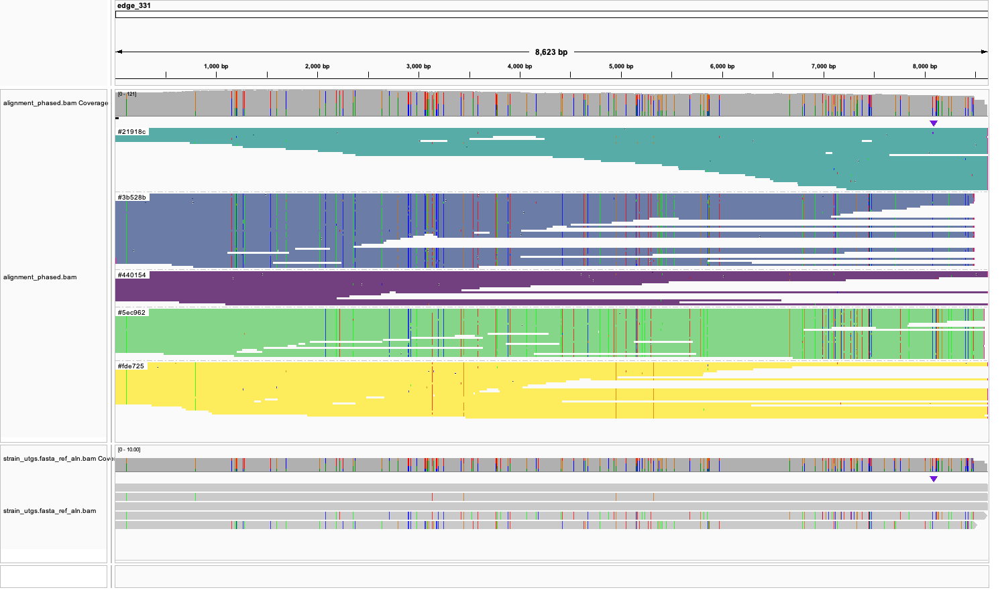
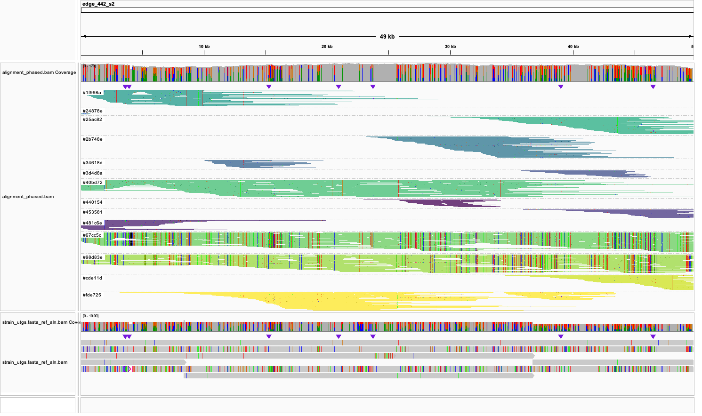
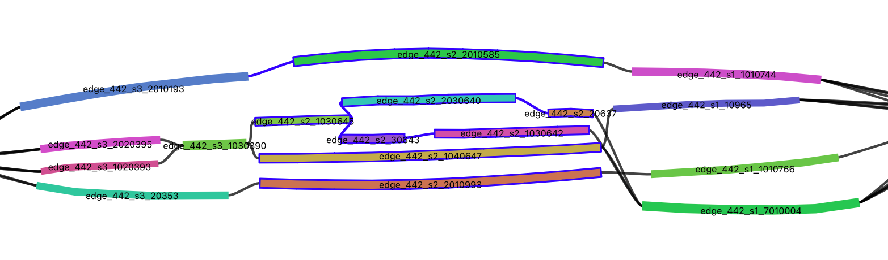
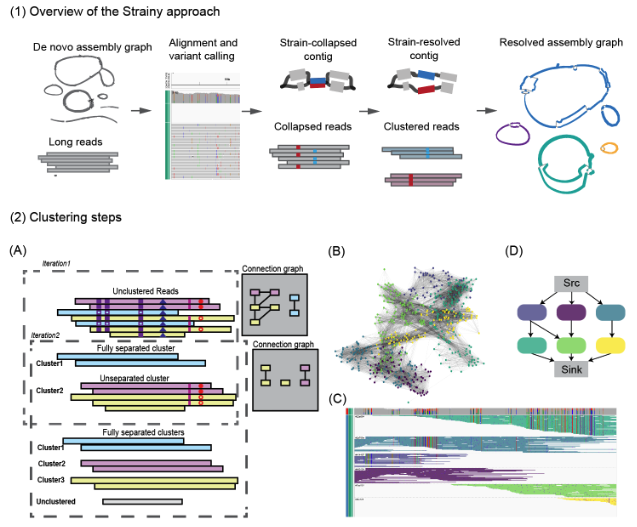

[![CC BY-NC-SA 4.0][cc-by-nc-sa-shield]][cc-by-nc-sa]

## Strainy

### Version 1.0

Strainy is a tool for phasing and assembly of bacterial strains from long-read sequencing data (either Oxford Nanopore or PacBio).
Given a reference (or collapsed de novo assembly) and set of aligned reads as input, Strainy produces 
multi-allelic phasing, individual strain haplotypes and strain-specific variant calls.

Compared to the current metagenomic strain profiling approaches, Strainy offers multiple unique features. 
First, it provides direct phasing of strains-specific variants, enabling evolutionary analysis of haplotypes rather than individual mutations. 
Second, Strainy provides a method to quantity strains and distinguish the most abundant and/or most divergent strains. 
Third, Strainy enables assembly-based analysis, which is useful in the absence of a high quality reference genome, especially in cross-samples comparison.

## Contents
* [Installation](#installation)
* [Quick Usage](#quick-usage)
* [Docker container](#docker-container)
* [Strainy input](#strainy-input)
* [Preparing de novo metagenomic assemblies](#preparing-de-novo-metagenomic-assemblies)
* [Parameters description](#parameters-description)
* [Output Files](#output-files)
* [Strainy tutorial](#strainy-tutorial)
* [Overview of the Strainy algorithm](#overview-of-the-strainy-algorithm)


## Installation

The recommended way of installing is through [conda](https://conda.io/projects/conda/en/latest/user-guide/install/index.html):

```
git clone https://github.com/katerinakazantseva/strainy
cd strainy
git submodule update --init
make -C submodules/Flye
conda env create -f environment.yml -n strainy
```

Once installed, you will need to activate the conda environment prior to running:

```
conda activate strainy
./strainy.py -h
```

Note that if you use an M1 conda installation, you should run `conda config --add subdirs osx-64` before installation. 
Find details [**here**](https://github.com/conda/conda/issues/11216)

## Quick usage

After repository cloning/installation, you should be able to run:

```
conda activate strainy
./strainy.py --gfa test_set/toy.gfa --fastq test_set/toy.fastq.gz --output out_strainy --mode hifi --threads 8
```

The `--gfa` specifices input strain-collapsed graph (e.g. from de novo metagenomic assembly). `--fastq`
specifies the matching long-read data. `--output` is the output directory, `--mode` speficies read type (either hifi or nano), 
`--threads` specifices the number of threads o use.

The output directory `out_strainy` will contain strain-level assmebly `strain_contigs.gfa` along with 
phased alignment `alignment_phased.bam`, strain variants calls `strain_variants.vcf` and other info.
See below for the details on how to interpret strainy output.

Also see a more detailed [tutorial](#strainy-tutorial) for the example of how to use Strainy.

## Docker container

Alternatively, you can use a Docker container (using the example provided in `test_set` Strainy directory):

```
ST_DIR=`pwd`
docker run -v $ST_DIR:$ST_DIR -u `id -u`:`id -g` mkolmogo/strainy:1.0 strainy --gfa $ST_DIR/test_set/toy.gfa --fastq $ST_DIR/test_set/toy.fastq.gz -o $ST_DIR/out_strainy --threads 8 --mode hifi
```

## Strainy input

Strainy supports PacBio HiFi, Nanopore R9 (Guppy5+) and R10 sequencing. 

The two main inputs to Strainy are:
* `GFA file` A collapsed de novo metagenomic assembly that can be produced with [**metaFlye**](https://github.com/fenderglass/Flye). 
For metaFlye parameters, please see [Preparing de novo metagenomic assemblies](#preparing-de-novo-metagenomic-assemblies).
Alternatively, a reference in fasta format could be converted into a gfa and provided as input.

* `Reads (fasta/fastq)` containing reads that need to be assmebled / phased. In the case of improving collapsed de novo assembly,
same reads should be used for the assembler input.

* `Optinal alignment / variant calls`. A user can provide their own alignment in `bam` format and
variant calls in `vcf` format (that will be used for phasing). If these files are provided, splitting
of long unitigs must be disabled by adding `--unitig-split-length 0`. It is recommended
to split long sequences prior to producing alignment / variant calls, for example using the Strainy 
`--only-split` option. Long unitigs (50 kb+) may significantly slow down Strainy.

## Preparing de novo metagenomic assemblies

We have developed Strainy using metaFlye metagenomic assembly graphs as input. The recommended
set of parameters is `--meta --keep-haplotypes --no-alt-contigs -i 0`. 

Note that `-i 0` disables metaFlye's polishing procedure, which we found to improve read assignment
to bubble branches during `minimap2` realignment. `--keep-haplotypes` retains structural
variations between strains on the assembly graph. `--no-alt-contigs` disables the output of
"alternative" contigs, which can later confuse the read aligner.

## Parameters description

### Required

| Argument  | Description |
| ------------- | ------------- |
|-o, --output	|Output directory|
|-g, --gfa	|Input assembly graph (.gfa) (may be produced with metaFlye or minigraph)|
|-q, --fastq	|FASTQ file containing reads ( PacBio HiFi or  Nanopore sequencing)|
|-m, --mode	|Type of the reads {hifi,nano}|

### Optional

| Argument  | Description |
| ------------- | ------------- |
| --snp 	| .vcf file, with variants of the desired allele frequency. If not provided, Strainy will use the built-in pileup-based caller|
|-b, --bam 	| .bam file generated by aligning the input reads to the input graph, minimap2 will be used to generate a .bam file if not provided|
| -a, --allele-frequency 	| Allele frequency threshold for built-in pileup-based caller. Will only work if --snp is not used (default: None)|
| -d, --cluster-divergence |	The maximum number of total mismatches allowed in the cluster per 1 kbp. Should be selected depending on SNP rates and their accuracy. Higher values can reduce high fragmentation at the cost of clustering accuracy (default: None)|
| --unitig-split-length 	|The length (in kb) which the unitigs that are longer will be split, set 0 to disable (default: 50 kb)|
|--min-unitig-coverage 	|The minimum coverage threshold for phasing unitigs, unitigs with lower coverage will not be phased (default: 20)|
|--max-unitig-coverage  |The maximum coverage threshold for phasing unitigs, unitigs with higher coverage will not be phased (default: 500)|
|-t, --threads 	| Number of threads to use (default: 4)|
|--debug  |	Enables debug mode for extra logs and output |
|-s, --stage	| Stage to run: phase, transform or e2e (phase + transform) (default: e2e)|

## Output files

* `alignment_phased.bam`	Phased input alignemnt. Phased is defined via `YC` tag, which could also be used for IGV visualization.
The matching reference could be found at `preprocessing_data/gfa_converted.fasta`.
If (unphased) alignment was not provided as input,  Strainy produced alignment against the input gfa using minimap2.

* `strain_unitigs.gfa` Tranformed graph that incorporates assmebled strain haplotypes. These are "finer" strain
unitigs that match the CSV tables with additional info below.

* `strain_contigs.gfa` A simplified and extended version of teh graph after final simplification.
Some strain unitigs are joined into longer contigs, so these sequenced may no longer have
IDs matching to the CSV tables below.

* `strain_variants.vcf` A file with variant produced from assembled strain haplotypes in VCF format.
In the INFO field, `ALT_HAP` refers to strain unitigs that support the ALT version of the variant,
and `REF_HAP` correspond to the list of unitigs that contain no variant (reference state).

* `reference_unitig_info_table.csv` Additional statistics for **reference** sequences (such as length, coverage, SNP rate).

* `phased_unitig_info_table.csv` Statistics for each phased strain unitig (matching the `strain_unitigs.gfa` file).
For each strain unitig, its length, coverage, SNP rate and other statistics are reported.

* `multiplicity_stats.txt` Dataset-level summary of strain multiplicity and strain divergence, along with other assembly-based statistics.

## Strainy tutorial

Here we illustrate Strainy usage scenario using the simulated metagenomic dataset of five E. coli strains.
Download the input data:

```
wget https://zenodo.org/records/11187925/files/strainy_ecoli_example.tar.gz
tar -xvf strainy_ecoli_example.tar.gz
```

It contains simulated reads and metaFlye assembly graph. Optionally, if you want to reproduce the metaFlye assembly, you can run:

```
flye --nano-hq strainy_ecoli_example/ecoli_5strain_sim_badread.fastq.gz -o metaflye -t 30 --meta --no-alt-contigs --keep-haplotypes -i 0
```

Then, you can run Strainy using:

```
./strainy.py --gfa strainy_ecoli_example/ecoli_5strain_metaflye_hap.gfa --fastq strainy_ecoli_example/ecoli_5strain_sim_badread.fastq.gz --mode nano -t 30 --output strainy_out
```

This run may take ~2h in 30 threads. If you don't want to wait, you can download results from here:

```
wget https://zenodo.org/records/11187925/files/strainy_ecoli_out.tar.gz
tar -xvf strainy_ecoli_out.tar.gz
```

Now, let's take a look at the results! `multiplicity_info.txt` will contain some assembly stats, and the information about strain multiplicity:

```
Reference utgs input:	len: 6459094	num: 515	N50:28856
Reference utgs select:	len: 6367432	num: 433	N50:29273
Reference utgs phased:	len: 5439417	num: 319	N50:31133
Strain utgs asmembled:	len: 20620769	num: 1729	N50:16393

Multiplicity
Mul	RefSeqLength
1	   1653400	********************
2	    455200	*****
3	    770300	*********
4	   1634900	*******************
5	   1547500	******************
6	    246800	**
7	     21700	
8	      8300	
10	      1800
```

The total input size was ~6.4Mb, and Strainy transformed it into 20.6 Mb of strain-specific sequence. ~1.6 of the input reference
strain had multiplicity 1 - e.g. not collapsed, but the rest corresponded to 2+ strains. Most collapsed sequence had either 4 or 5.
The bottom of the file also contains info about the divergence of the assembled strain (wrt to the collapsed reference):

```
SNP divergence
Rate	StrainSeq
0.03981	371500	**
0.03162	1099100	*******
0.02512	1563900	**********
0.01995	1495400	*********
0.01585	2964600	*******************
0.01259	2523100	****************
0.01000	3052800	********************
0.00794	1685300	***********
0.00631	1516200	*********
0.00501	861600	*****
0.00398	586200	***
0.00316	374300	**
0.00251	301800	*
0.00200	233500	*
```

Next, let's use [IGV](https://igv.org/) to look in more detail. Open `preprocessing_data/gfa_converted.fasta` as a reference,
and `alignment_phased.bam` as a track. This shows the phased alignment, and you can enable coloring and grouping by `YC` tag.
In addition, you can add `intermediate/strain_utgs.fasta_ref_aln.bam` track with the assmebled strain haplotgs. It may look
something like this, clearly showing 5 read clusters and assembled haplotypes:



Each variant position will be described in `strain_variants.vcf`. For example, the following VCF entry tells that the substitution is supported
by 2 strains (enumerated in `ALT_HAP`), and 3 strains have reference state (enumerated in `REF_HAP`).

```
edge_308    3453    Strainy_SNP_17146   G   T   60  PASS    ALT_HAP=edge_308_119,edge_308_1000107;REF_HAP=edge_308_10015,edge_308_10014,edge_308_20016  GT:DV:D      P    0/1:2:5
```

But often, it may look a bit more complex. On the example  eblow you see more strain clusters that sometimes do not span the entire reference unitig.
This often happens if there is not enough heterozygosity to separate two or more strains:



In fact, if you visualize the `strain_unitigs.gfa` with [Bandage](https://github.com/rrwick/Bandage), you can see how
these strain unitigs are connected together:



Finally, `phased_unitig_info_table.csv` contains statistics about individual phased strain unitigs.

## Overview of the Strainy algorithm

<p align="center">
  
</p>

This is a brief description, and more details are available in [our preprint](https://www.biorxiv.org/content/10.1101/2023.01.31.526521v2).

The goal of the Strainy is to recover collapsed strain haplotypes from the input graph. 
First, input reads are mapped against the input assembly graph and the alignment is used to call SNP variants (which could also be provided as input). 
Then, the phasing module is used to group aligned reads into strain clusters. Afterwards, strain haplotypes are reassembled from clustered reads.

In brief, the phasing module works as follows. First, for each strain-collapsed input contig, Strainy builds a connection graph, which encodes the pairwise distances between reads aligned to this contig. 
Next, it clusters reads based on the strain of origin using the community detection approach. 
While initial clustering separates the most divergent strains, closely related strains (with less variants between them) may remain collapsed. 
To overcome this, Strainy recursively repeats the clustering procedure with the increased sensitivity to strain variants 
Clustering stringency threshold may be increased to allow collapsing of very similar strains, while separating more divergent strains.

Clustered reads are then reassembled locally using the Flye polisher, forming strain haplotigs. 
Strainy builds an overlap graph of these haplotigs, where paths on the graph correspond to phased strain sequence, interleaved by unphased sequences. 
Finally, Strainy applies graph simplification algorithms to improve the assembly contiguity. 
As output, Strainy provides assembled strain haplotypes, along with phased read alignment, strain variant calls (small and structural) 
and information about strain multiplicity and divergence.


## Acknowledgements

Consensus function of Strainy is [**Flye**](https://github.com/fenderglass/Flye)

Community detection algorithm is [**Karate club**](https://github.com/benedekrozemberczki/KarateClub/blob/master/docs/source/notes/introduction.rst)

## Contributers

Strainy was originally developed at at [**Kolmogorov lab at NCI**](https://ccr.cancer.gov/staff-directory/mikhail-kolmogorov)  

Code contributors:
- Ekaterina Kazantseva
- Ataberk Donmez
- Mikhail Kolmogorov

## Citation

Ekaterina Kazantseva, Ataberk Donmez, Maria Frolova, Mihai Pop, Mikhail Kolmogorov.
"Strainy: assembly-based metagenomic strain phasing using long reads"
bioRxiv 2023, [https://doi.org/10.1101/2023.01.31.526521](https://www.biorxiv.org/content/10.1101/2023.01.31.526521v2)

## License

This work is licensed under a
[Creative Commons Attribution-NonCommercial-ShareAlike 4.0 International License][cc-by-nc-sa].

[![CC BY-NC-SA 4.0][cc-by-nc-sa-image]][cc-by-nc-sa]

[cc-by-nc-sa]: http://creativecommons.org/licenses/by-nc-sa/4.0/
[cc-by-nc-sa-image]: https://licensebuttons.net/l/by-nc-sa/4.0/88x31.png
[cc-by-nc-sa-shield]: https://img.shields.io/badge/License-CC%20BY--NC--SA%204.0-lightgrey.svg
